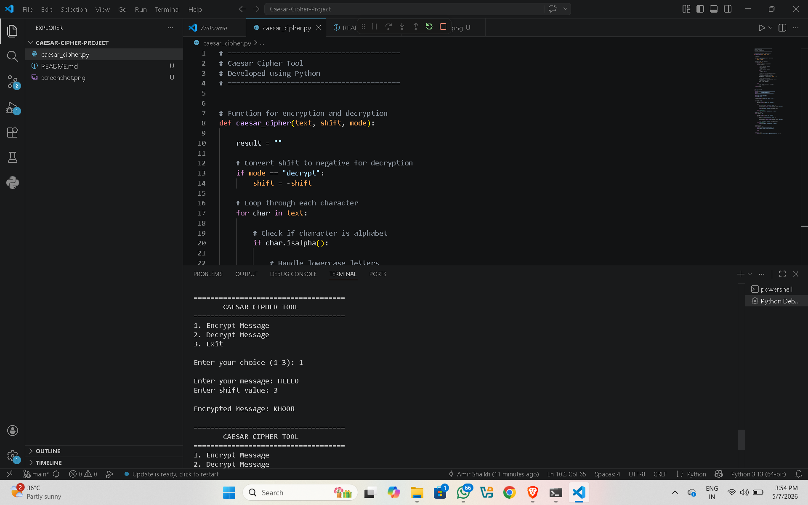

# Caesar Cipher Tool 🔐

A simple Python-based Caesar Cipher Tool that can encrypt and decrypt messages using shift values.

## Features
- Encrypt Messages
- Decrypt Messages
- User-Friendly Interface
- Handles Uppercase & Lowercase Letters

## Technologies Used
- Python 3

## How to Run

```bash
python caesar_cipher.py
```

## Example

Message: hello  
Shift: 3  

Encrypted Message: khoor

## Project Screenshot 




## Author
Amir Shaikh